# Ejercicio 02 - Creacion de prefabs, variantes y terrenos

Este proyecto consiste en
 
a) Creacion de un prefab junto a cuatro variantes del personaje Kirby unicamente usando las formas
   basicas provistas por Unity

b) Representar una configuracion geologica usando el objeto terreno en Unity

## a) - Creacion del prefab de Kirby

Se utilizo una esfera para crear el cuerpo de Kirby y dos capsulas para crear los ojos. Todos los
componentes de este fueron unidos usando la funcion de jerarquia en Unity. Una vez la jerarquia fue
establecida, arrastramos el modelo hacia la seccion de "Assets" para convertirlo en un prefab

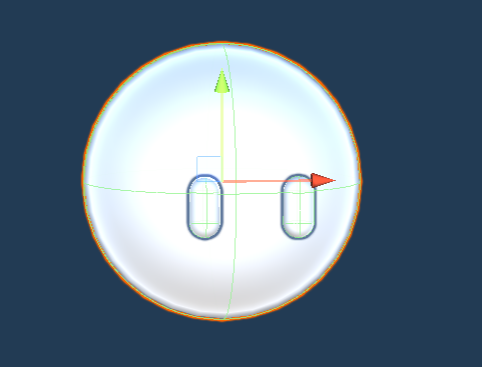

## a.ii)  Creacion de las variantes de Kirby

### I.  Variante Kirby Link (Sword)

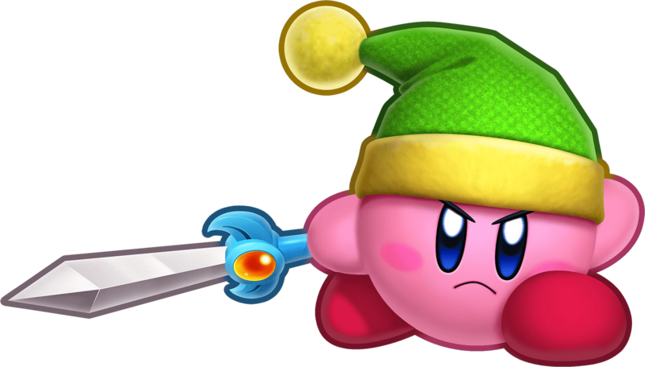

Lo primero que se hizo fue posicionar las extremidades lo mas cercano a como se puede ver en la imagen.
Para los brazos se usaron esferas. Para las piernas se usaron capsulas.

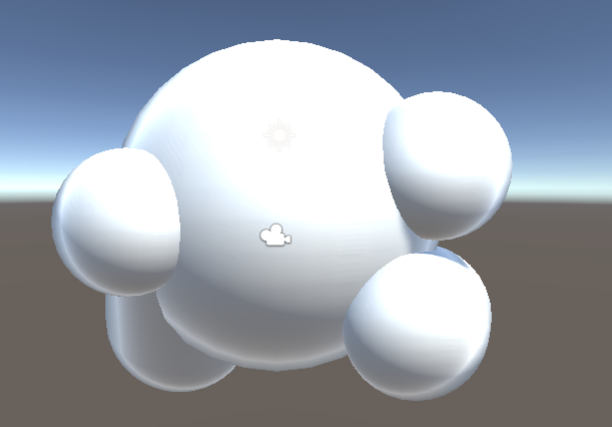
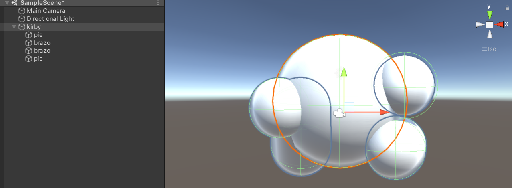

Para poder posicionar las extremidades fue necesario tomar en consideracion los angulos y la posicion
con relacion al cuerpo (prefab) 

Luego de completar las extremidades se le annadieron los accesorios.

El sombrero fue creado utilizando dos capsulas (la base del sombrero y la "cola" (darle longitud)) y 
una esfera para la bolita al final.

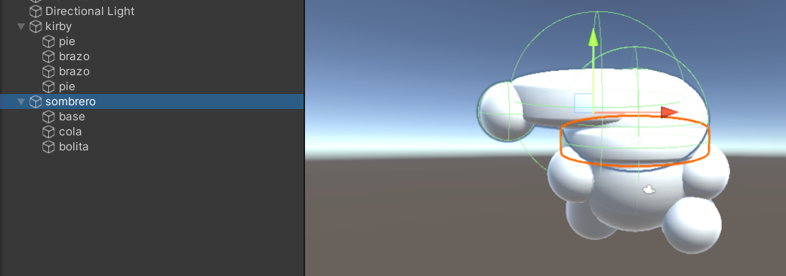

La espada fue creada con cuatro cubos. Dos fueron utilizados para crear el mango de la espada, 
uno para crear la hoja de la espada y el ultimo para crear el filo. 
El filo fue creado girando el cubo a 45 grados y posicionandolo en el borde, ya que Unity no tiene triangulos. 

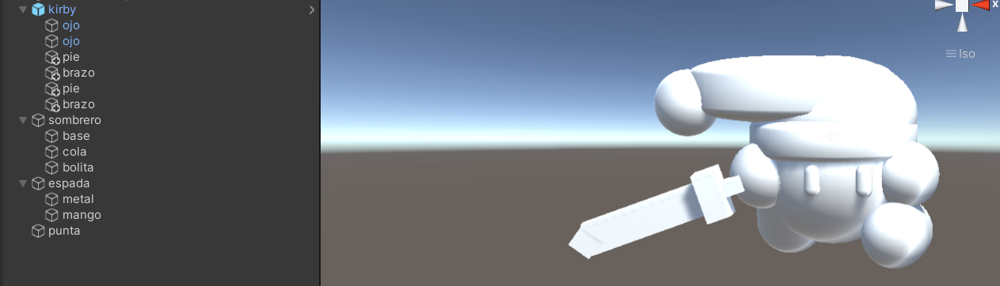

Como toque final se le anadio color al modelo

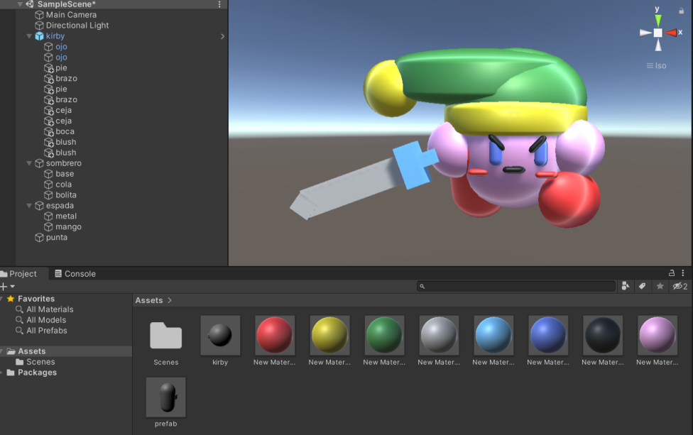

### II. Variante Kirby Pintor (Artist)

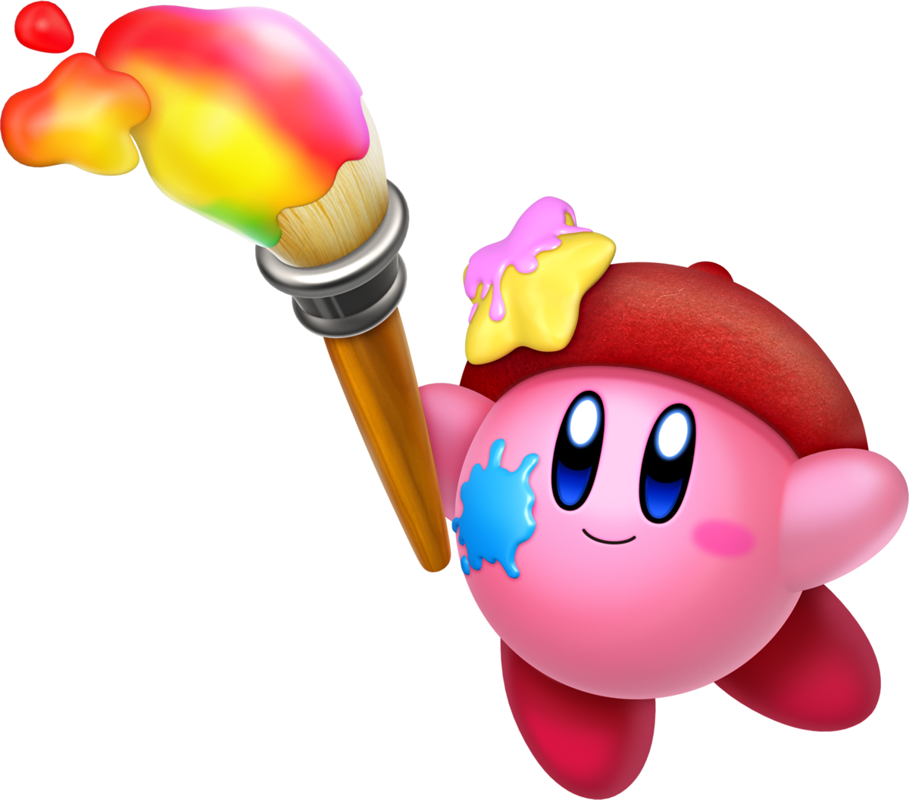

Se inicio de la misma manera en que se inicio el primer variante de Kirby y se tomaron en consideracion
las mismas cosas descritas en el variante de Link.

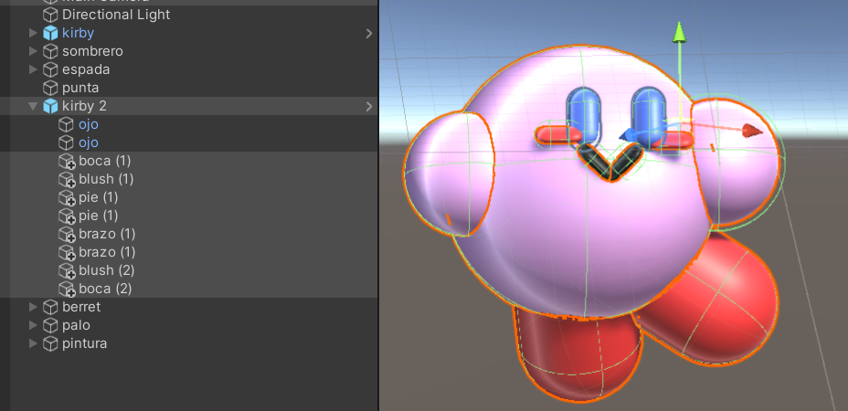

Luego de completar a Kirby se le anadieron accesorios de acuerdo a su habilidad.

El berret fue creado usando una capsula (para darle un angulo al berret como en la foto), una esfera (para
cubrir la cabeza completamente), y una esfera (bolita)

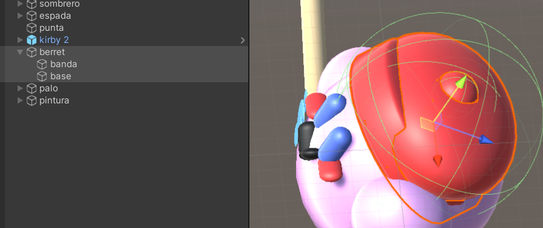

La brocha fue creada dos cilindros (mango y base de la brocha) y dos capu=sulas (la brocha y la parte
de la brocha cubierta con pintura) 

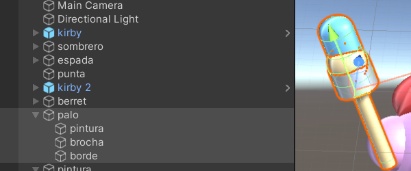

La pintura fue creada utilizando una combinacion de esferas y capsulas para imitar una mancha de pintura.
Estas fueron aplanadas para que se vieran un poco como "liquido". Para lograr este efecto se logro dandole
un valor de 0.5 al eje de Z.

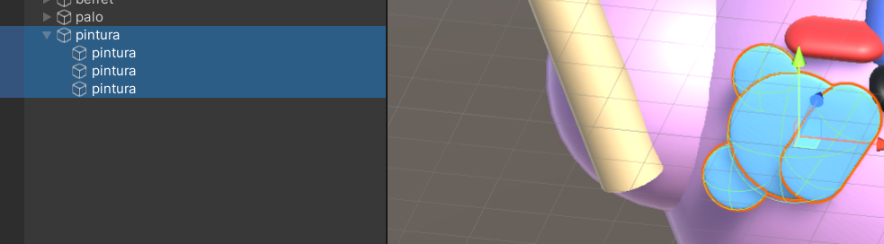

Resultado final del modelo:

### III.  Variante Kirby 3

### IV.  Variante Kirby 4

## b)  Region geologica

##  Conclusion

