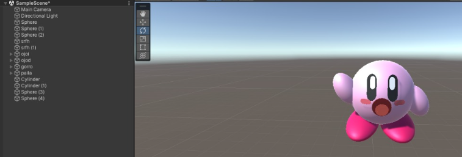
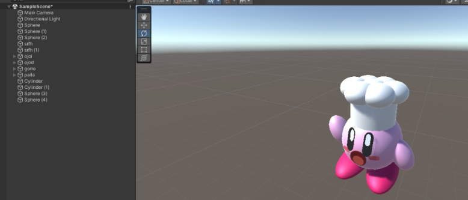
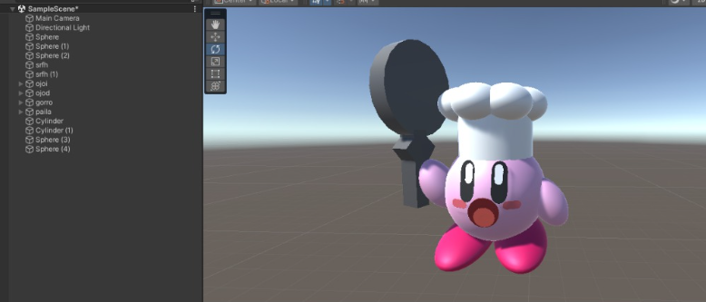
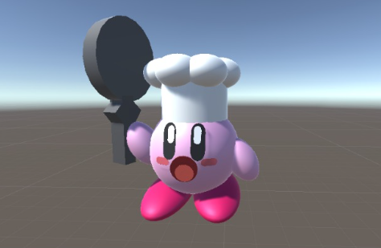
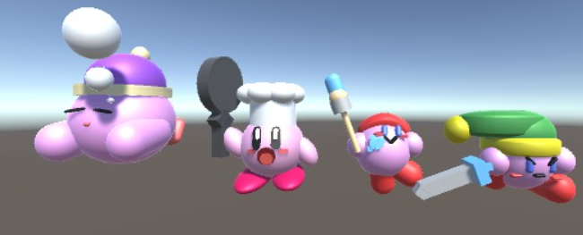
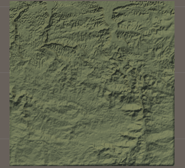
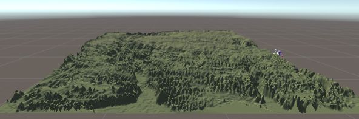
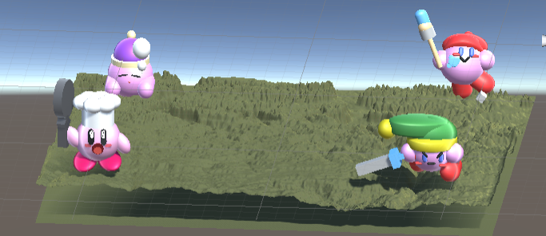

# Ejercicio 02 - Creacion de prefabs, variantes y terrenos

Este proyecto consiste en
 
a) Creacion de un prefab junto a cuatro variantes del personaje Kirby unicamente usando las formas
   basicas provistas por Unity

b) Representar una configuracion geologica usando el objeto terreno en Unity

## a) - Creacion del prefab de Kirby

Se utilizo una esfera para crear el cuerpo de Kirby y dos capsulas para crear los ojos. Todos los
componentes de este fueron unidos usando la funcion de jerarquia en Unity. Una vez la jerarquia fue
establecida, arrastramos el modelo hacia la seccion de "Assets" para convertirlo en un prefab

## a.ii)  Creacion de las variantes de Kirby

### I.  Variante Kirby Link (Sword)

Lo primero que se hizo fue posicionar las extremidades lo mas cercano a como se puede ver en la imagen.
Para las manos  se usaron esferas. Para los pies se usaron capsulas.

Para poder posicionar las extremidades fue necesario tomar en consideracion los angulos y la posicion
con relacion al cuerpo (prefab) 

Luego de completar las extremidades se le annadieron los accesorios.

El sombrero fue creado utilizando dos capsulas (la base del sombrero y la "cola" (darle longitud)) y 
una esfera para la bolita al final.

La espada fue creada con cuatro cubos. Dos fueron utilizados para crear el mango de la espada, 
uno para crear la hoja de la espada y el ultimo para crear el filo. 
El filo fue creado girando el cubo a 45 grados y posicionandolo en el borde, ya que Unity no tiene triangulos. 

Como toque final se le anadio color al modelo

### II. Variante Kirby Pintor (Artist)

Se inicio de la misma manera en que se inicio el primer variante de Kirby y se tomaron en consideracion
las mismas cosas descritas en el variante de Link.

Luego de completar a Kirby se le anadieron accesorios de acuerdo a su habilidad.

El berret fue creado usando una capsula (para darle un angulo al berret como en la foto), una esfera (para
cubrir la cabeza completamente), y una esfera (bolita)

La brocha fue creada dos cilindros (mango y base de la brocha) y dos capu=sulas (la brocha y la parte
de la brocha cubierta con pintura) 

La pintura fue creada utilizando una combinacion de esferas y capsulas para imitar una mancha de pintura.
Estas fueron aplanadas para que se vieran un poco como "liquido". Para lograr este efecto se logro dandole
un valor de 0.5 al eje de Z.

Resultado final del modelo:

### III.  Variante Kirby Cocinero (Cook)

Para la creacion de los ojos y la boca de este Kirby se usaron esferas y capsulas casi planas. Para las
extremidades se usaron capsulas.

Luego se le annadieron los accesorios.

El sombrero fue creado con un cilindro junto repeticion de esferas en el tope de este. 

El sarten fue creado con dos cubos (uno alargado para el mango, y otro rotado 45 grados para el boorde(?) de este)
junto a una capsula(?) para crear el sarten como tal (no se como se llama)

Resultado final del modelo:

### IV.  Variante Kirby Durmiendo (Sleep)

Comenzamos creando una esfera y moldearlo a una figura mas parecida a un ovalo, esto disimulara el cuerpo relajado de Kirby cuando duerme

<photo 1>

Añademos una cara de dormilón, mediante dos capsulas inclinadas como los ojos y un circulo abajo en el medio como la boca.

<photo 2>

Dos capsulas paralelas inclinadas y insertadas en la esfera para generar la poscición recostada del modelo. Igual que, en la parte de atrás, colocamos dos esferas aplstadas paralelas en la como los pies de kirby.

<photo 3>

Colocamos 3 esferas, comenzando desde cerca de la boca de kirby, hacia el cielo aumentando el tamaño ascendentemente. Esto disimula como si estuviera soñando como en las caricaturas.

<photo 4>

Finalmente colocamos un gorro, el cual esta compuesto en un cilindro, una esfera y otra esfera pequeña encima como una gorra de dormir.

<photo 5>

#### Showcase de todas las variantes

## b)  Region geologica

img especfica que se uso del area porfa

Seleccionamos el area geologica de Corozal para hacer el terreno. La manera en la que lo hicimos fue tomando una captura de
pantalla al area seleccionada y dandosela a Unity para que creara una renderizacion lo mas parecido posible.

seba explica que hiciste porfa 

La editamos para que fuera aun mas parecida y terminamos con este terreno:

De frente para que sea mas apreciado

Luego simplemente colocamos los Kirbys en el terreno

 

## c) Experiencias con Kirby

Adriana N Hernandez Vega - Nunca he jugado un juego de Kirby, pero si he jugado con el personaje de Kirby en el
juego Super Smash Bros. Siempre trato de copiar las habilidades de los otros jugadores y usarlas a mi favor.

Berbardo A. Bermúdez Noriega - Durante la pandemia, jugue Kirby Planet Robot por primera vez. Ademas de poder absorber las abilidades de los enemigos, siendo interesado en ficción mecha, me fascinó que podía transformarme en un robot con sus probias abilidades.

