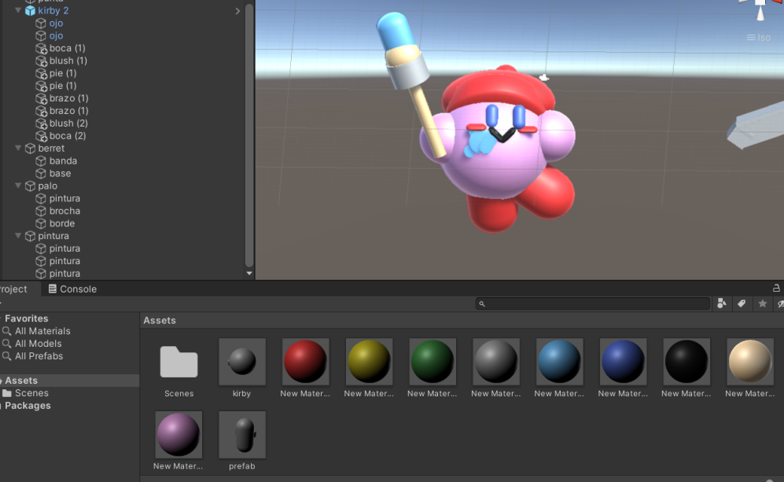

# Ejercicio 02 - Creacion de "prefabs", variantes y terrenos.

Este proyecto consiste en:
 
a) Creación de un "prefab" junto a cuatro variantes del personaje Kirby únicamente usando las formas
   básicas provistas por Unity.

b) Representar una configuración geológica usando el objeto terreno en Unity.

## a) - Creación del prefab de Kirby.

Se utilizó una esfera para crear el cuerpo de Kirby y dos cápsulas para crear los ojos. Todos los
componentes de este fueron unidos usando la función de jerarquía en Unity. Una vez la jerarquía fue
establecida, arrastramos el modelo hacia la sección de "Assets" para convertirlo en un prefab.

## a.ii)  Creación de las variantes de Kirby.

### I.  Variante Kirby Link (Sword).

Lo primero que se hizo fue posicionar las extremidades lo más cercano a como se puede ver en la imagen.
Para las manos se usaron esferas. Para los pies se usaron cápsulas.

Para poder posicionar las extremidades fue necesario tomar en consideración los ángulos y la posición
con relación al cuerpo (prefab). 

Luego de completar las extremidades se le añadieron los accesorios.

El sombrero fue creado utilizando dos cápsulas (la base del sombrero y la "cola" (darle longitud)) y 
una esfera para la bolita al final.

La espada fue creada con cuatro cubos. Dos fueron utilizados para crear el mango de la espada, 
uno para crear la hoja de la espada y el último para crear el filo. 
El filo fue creado girando el cubo a 45 grados y posicionandolo en el borde, ya que Unity no tiene triángulos. 

Como toque final se le anadio color al modelo.

### II. Variante Kirby Pintor (Artist).

Se inicio de la misma manera en que se inicio el primer variante de Kirby y se tomaron en consideración
las mismas cosas descritas en el variante de Link.

Luego de completar a Kirby se le añadieron accesorios de acuerdo a su habilidad.

El berret fue creado usando una cápsula (para darle un ángulo al berret como en la foto), una esfera (para
cubrir la cabeza completamente), y una esfera (bolita)

La brocha fue creada dos cilindros (mango y base de la brocha) y dos cápsulas (la brocha y la parte
de la brocha cubierta con pintura).

La pintura fue creada utilizando una combinación de esferas y cápsulas para imitar una mancha de pintura.
Estas fueron aplanadas para que se vieran un poco como "líquido". Para lograr este efecto se logro dándole
un valor de 0.5 al eje de Z.

Resultado final del modelo:

### III.  Variante Kirby Cocinero (Cook).

Para la creación de los ojos y la boca de este Kirby se usaron esferas y cápsulas casi planas. Para las
extremidades se usaron cápsulas.

Luego se le añadieron los accesorios.

El sombrero fue creado con un cilindro junto repetición de esferas en el tope de este. 

El sartén fue creado con dos cubos (uno alargado para el mango, y otros dos rotados 45 grados para el borde de este)
junto a una cilindro aplanado para crear el sartén.

Resultado final del modelo:

### IV.  Variante Kirby Durmiendo (Sleep)

Comenzamos creando una esfera y moldearlo a una figura mas parecida a un óvalo, esto disimulara el cuerpo relajado de Kirby cuando duerme

Se añade la cara de dormilón, mediante dos cápsulas inclinadas como los ojos y un círculo abajo en el medio como la boca.

Dos cápsulas paralelas inclinadas y insertadas en la esfera para generar la poscición recostada del modelo. Igual que, en la parte de atrás, colocamos dos esferas aplastadas paralelas en la como los pies de kirby.

Colocamos 3 esferas, comenzando desde cerca de la boca de kirby, hacia el cielo aumentando el tamaño ascendentemente. Esto disimula como si estuviera soñando como en las caricaturas.

Finalmente colocamos un gorro, el cual esta compuesto en un cilindro, una esfera y otra esfera pequeña encima como una gorra de dormir.

Resultado final del modelo:

#### Showcase de todas las variantes

## b)  Región geológica

Seleccionamos el area geológica de Corozal para hacer el terreno. La manera en la que lo hicimos fue tomando una captura de
pantalla al area seleccionada y dándosela a Unity para que creara una renderización lo mas parecido posible.

Se empieza creando un terreno normal y se le da las dimensiones deseadas

Luego con "Terrain tool" añadimos la imagen de ruido (es decir, la imagen tomada directamente del mapa de P.R.) y ajustamos los parámetros de altura.

Terminamos con el siguiente terreno:

De frente para que sea más apreciado.

Luego simplemente colocamos los Kirbys en el terreno.

 

## c) Experiencias con Kirby:

Adriana N Hernández Vega - Nunca he jugado un juego de Kirby, pero si he jugado con el personaje de Kirby en el
juego Super Smash Bros. Siempre trato de copiar las habilidades de los otros jugadores y usarlas a mi favor.

Bernardo A. Bermúdez Noriega - Durante la pandemia, jugue Kirby Planet Robobot por primera vez. Además de poder absorber las habilidades de los enemigos, siendo interesado en ficción "mecha", me fascinó que podía transformarme en un robot con sus probias habilidades.

Sebastian Hernández Sterling - Mi primera experiencia con Kirby fue en octavo grado a través de un emulador de Game Boy Advanced en mi primer celular, donde pude jugar los juegos en los que había visto jugar a mis compañeros varios años atrás, incluyendo el juego de Kirby and the Amazing Mirror donde resalta por tener un teléfono en el cual llama a sus amigos para que lo ayuden en su aventura.
