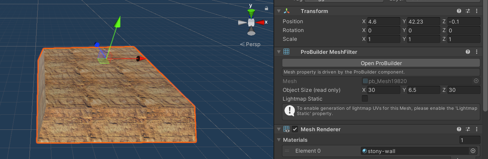
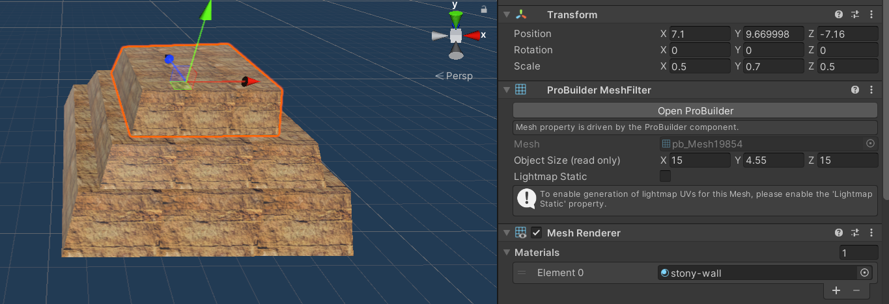
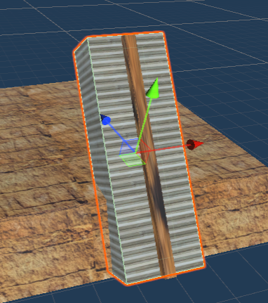
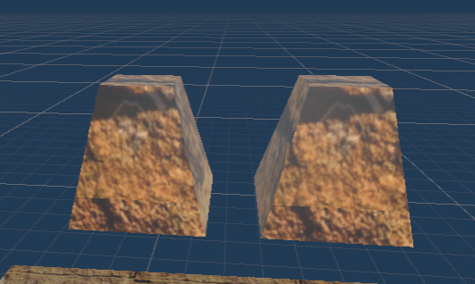
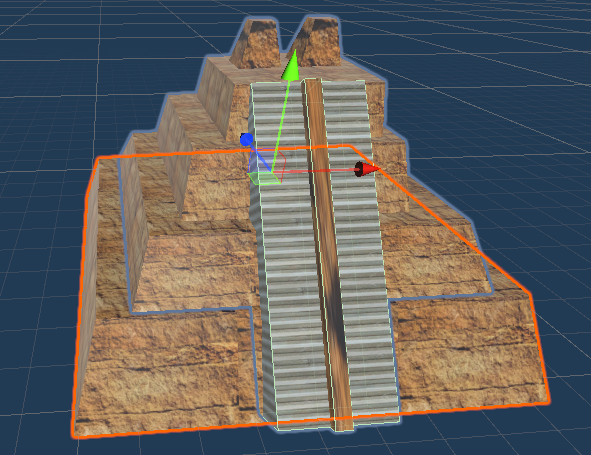
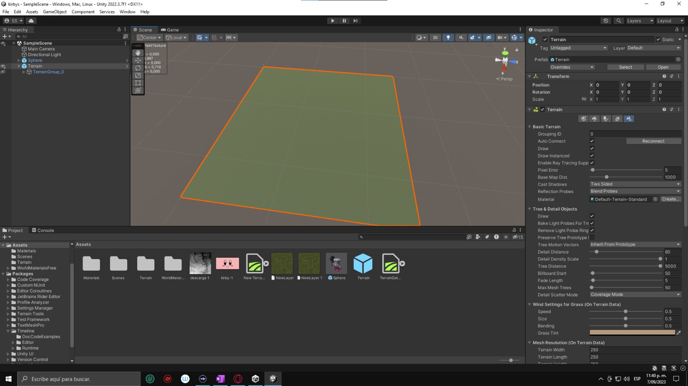
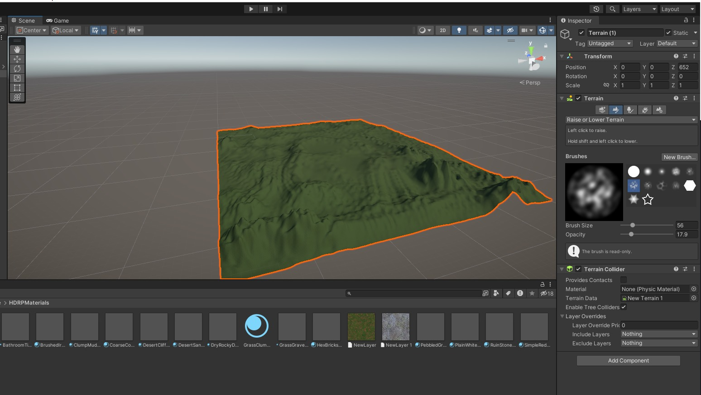
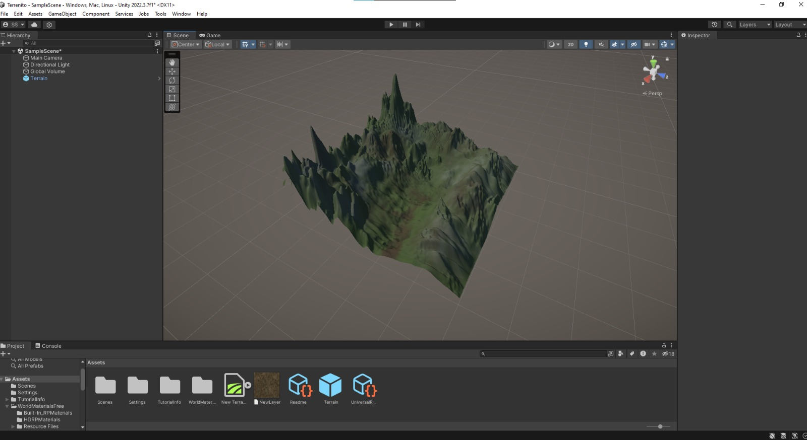

# Ejercicio 3 - Viva Mexico

Este proyecto consiste en:

a) Crear una piramide representando el Templo Mayor
b) Crear un terreno para la piramide
c) Importat assets de Asset Store para anadirlos a la escena
d) Crear una historia en base a las secciones previamente mencionadas

## a) Creacion de la piramide

Se utilizo la herramienta ProBuilder para la creacion de este. ProBuilder es una herramienta que requiere ser descargada antes.

La base fue creada utilizando un cubo en probuilder. Luego se aplico una seleccion de aristas. El proposito de esto fue empujar las aristas de la cara superior del cubo hacia adentro para hacer que la parte superior de este fuera mas pequena. Esto nos da un trapecio como base.

La piramide tiene otras tres capas. Para lograr estas duplicamos la base y le reducimos las dimensiones (en x y z)  en una escala de 0.25.

Para la creacion de las escaleras se uso un cubo simple. Se le dio algo de anchura para luego crear otro cubo mas finito y colocarselo en el medio. Esto es para representar que hay dos escaleras(?).

Para la creacion del tope de la piramide se utilizo otro cubo probuilder.Se hizo lo mismo que se hizo para los bloques de la piramide, solo que mas notable. Es mas ancho y hay una mayor diferencia entre la cara de abajo y la de arriba.

Ya al final se decidio colocar una textura de bloques/ladrillos arenosos para simular la antiguedad de la piramide (de acuerdo con lo visto en google). Para las escalaeras se utilizo una textura con muchas lineas arenosas para simular escalones.

## b) Creacion del terreno para la piramide

Se empieza creando un terreno normal y se le da las dimensiones deseadas. Se pinta con la textura deseada para la base.

Añadimos los "Layers" con las texturas que vayamos a usar para pintar los detalles. En este caso se les dio un tono azulado para dar la ilusión de un clima más frío.

Seleccionamos la herramienta de "Raise or Lower terrain" para darle el relieve.

Pintamos el terreno y añadimos detalles.

