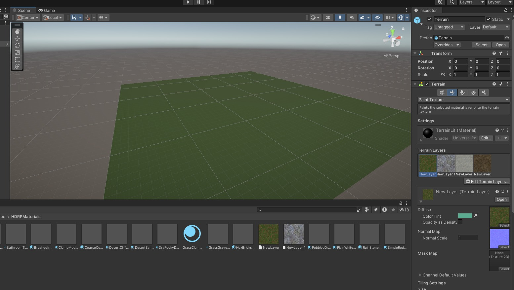
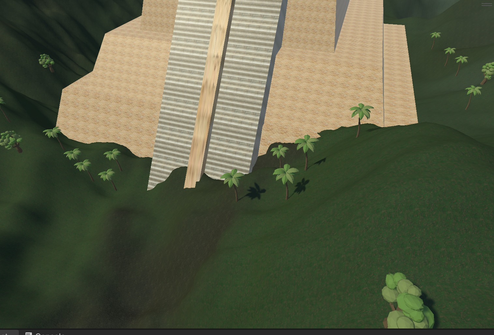
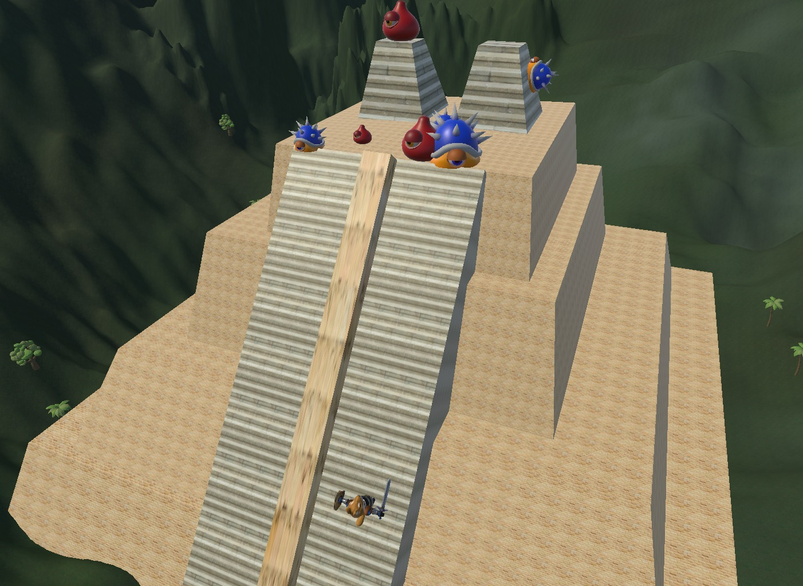
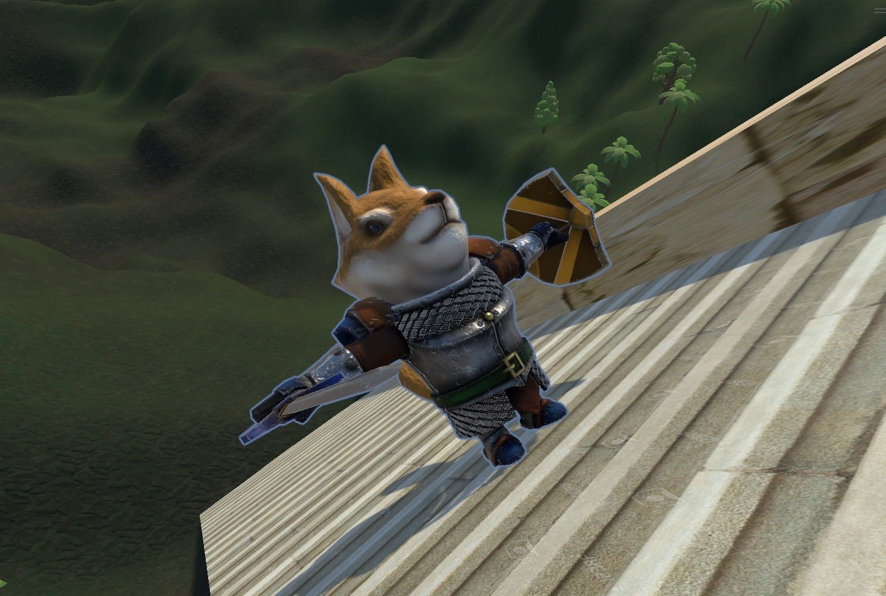
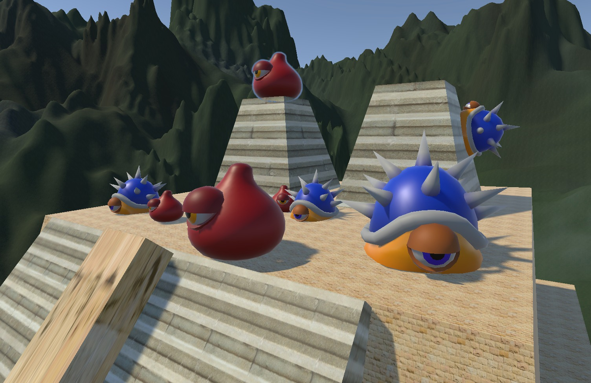
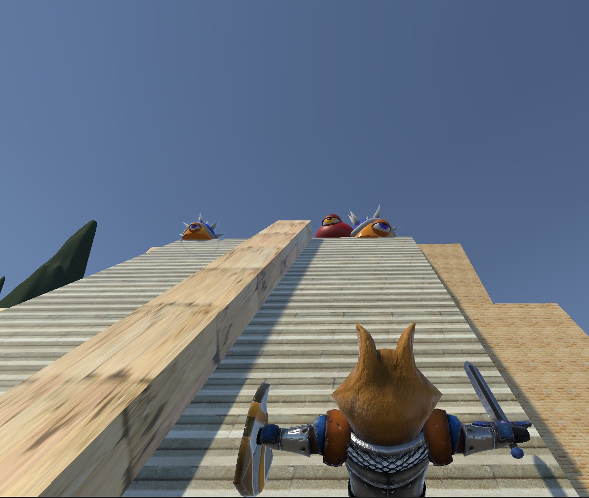

# Ejercicio 3 - Viva México

Este proyecto consiste en:

a) Crear una pirámide representando el Templo Mayor
b) Crear un terreno para la pirámide
c) Importat assets de Asset Store para anadirlos a la escena
d) Crear una historia en base a las secciones previamente mencionadas

## a) Creación de la pirámide

Se utilizó la herramienta ProBuilder para la creación de este. ProBuilder es una herramienta que requiere ser descargada antes.

La base fue creada utilizando un cubo en probuilder. Luego se aplicó una selección de aristas. El propósito de esto fue empujar las aristas de la cara superior del cubo hacia adentro para hacer que la parte superior de este fuera mas pequeña. Esto nos da un trapecio como base.

La pirámide tiene otras tres capas. Para lograr estas, duplicamos la base y le reducimos las dimensiones (en x y z)  en una escala de 0.25.

Para la creación de las escaleras se uso un cubo simple. Se le dio algo de anchura para luego crear otro cubo más finito y colocarselo en el medio. Esto es para representar que hay dos escaleras(?).

Para la creación del tope de la pirámide se utilizo otro cubo probuilder.Se hizo lo mismo que se hizo para los bloques de la pirámide, solo que más notable. Es mas ancho y hay una mayor diferencia entre la cara de abajo y la de arriba.

Ya al final se decidió colocar una textura de bloques/ladrillos arenosos para simular la antiguedad de la piramide (de acuerdo con lo visto en google). Para las escalaeras se utilizo una textura con muchas lineas arenosas para simular escalones.

## b) Creación del terreno para la pirámide

Se empieza creando un terreno normal y se le da las dimensiones deseadas. Se pinta con la textura deseada para la base.

Añadimos los "Layers" con las texturas que vayamos a usar para pintar los detalles. En este caso se les dio un tono azulado para dar la ilusión de un clima más frío.

Seleccionamos la herramienta de "Raise or Lower terrain" para darle el relieve.

Pintamos el terreno y añadimos detalles.

## C) Import de Assets

1. Combinamos el modelo de la pirámide y el terreno en una escena.

2. Luego añadimos árboles tropicales alrededor de la pirámide y otros tipos de arboles alrededor del área para crear inmersión.

3. Nombre de los Assets:

	Arboles: 
		Nombre: Free Trees
		Creador: Ada_King

	Monstruos
		Nombre: RPG Monster Duo PBR Polyart
		Creador: Dungeon Mason

	Furro:
		Nombre: Dog Knight PBR Polyart
		Creador: Dungeon Mason

## D) Creación de la historia 

Historia: La Leyenda Perruna

En un mundo lleno de misterio y maravillas, Furro se embarcó en una búsqueda épica en busca de su próxima gran aventura. Sus pasos lo llevaron hacia una tierra mística, envuelta en leyendas y secretos que solo podían ser imaginados por su tribu. Con cada paso, se internaba más en lo desconocido.

Mientras exploraba este nuevo mundo, el destino lo condujo hacia la majestuosa pirámide del Sagrado, un lugar que las leyendas mencionaban con reverencia. Pero algo era diferente esta vez. En lugar de encontrar la tribu ancestral que se había criado allí, se encontró con criaturas invasivas que infestaban el lugar sagrado.

Furro conectó los puntos y su mente se llenó de preguntas. ¿Qué había sucedido con la tribu que una vez habitó la pirámide? ¿Cómo es que estas criaturas habían atemorizado y expulsado a sus antiguos habitantes? Un fuego ardiente se encendió en el corazón valiente de Furro, y supo que era su destino enfrentar a estas criaturas invasivas y devolver la paz a la tierra sagrada.

Con determinación inquebrantable, Mr. Furro ascendió hasta la cumbre de la pirámide, preparado para el desafío que lo esperaba. La vista era impresionante: un horizonte lleno de criaturas que amenazaban con sumir en la oscuridad el legado de la tribu ancestral. Pero nuestro valiente héroe no retrocedió. Con cada paso, su espíritu se fortalecía y su coraje se volvía incandescente.

