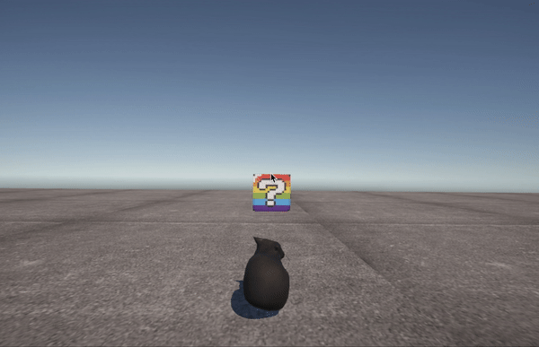
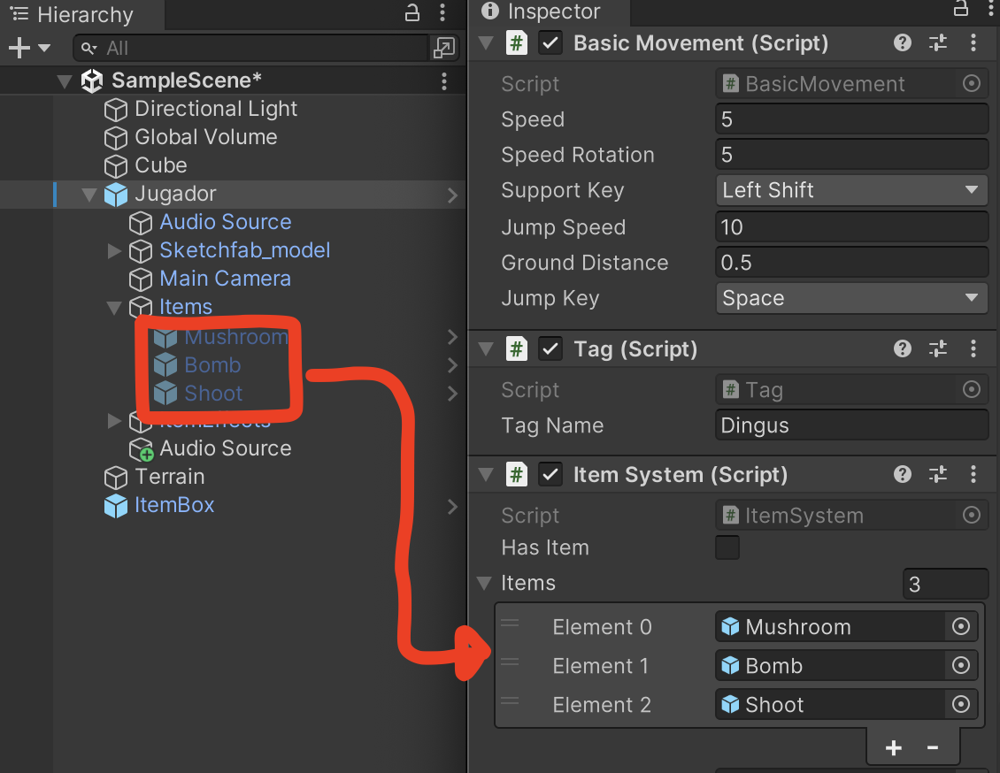
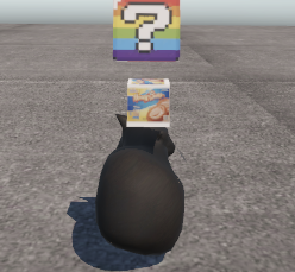
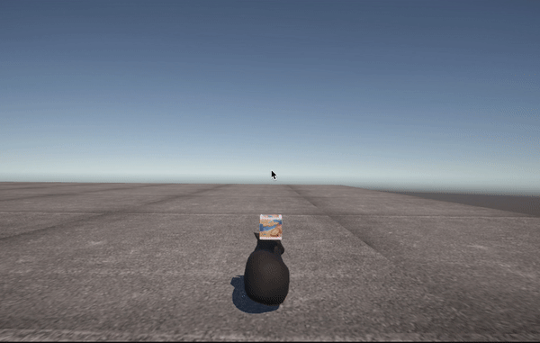
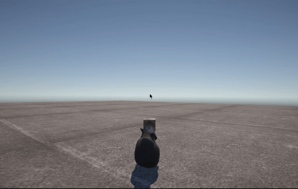

# Final Project - Fast Cats

El último proyecto de este curso consiste en crear un videojuego utilizando los conceptos que hemos aprendido en la clase. En esta documentación se encontrará el aspecto técnico y lo que contiene el juego.


## Item System

El Item Box es un sistema similar a los que muchos conocemos, un jugador hace contacto con la caja y se ejecuta una ruleta para ver cuál poder le tocó al jugador y utilizarlo para tomar ventaja y ganar la carrera.

Cuando el jugador hace contacto con un bloque sorpresa, el bloque desaparece por un segundo y vuelve.



En este tiempo, se invoca una función que escoge un item aleatorio de la lista de prefabs que contienen los items físicos. Esto funciona activando uno de los prefabs del los items que contiene el mismo jugador desactivados en el tope de la cabeza. OJO (Esto implica que los prefabs de los items que tiene el modelo del jugador, tienen que ser iguales a los de la lista)



Cuando le das al click izquierdo al mouse, desactiva el item dezplegado, y el script de ItemSystem.cs invoca la función del effecto del power up basado en el tag del prefab que fue desactivado.




## Powerups

Los siguientes powerups le puede salir al jugador dentro del Item Box.

### Boost

Aumenta la velocidad del jugador por unos segundos para poder pasarle a sus oponentes satisfactoriamente.


### HoneyBun

Como todos sabemos, los honeybuns ponen lento a una persona. En este caso el jugador emite tres honeybuns en la parte de atrás para los oponentes correr sobre ellos y paralizarlos temporalmente. Aún hay que tener cuidado, ya que si el jugador corre sobre estos mismos va a perder la velocidad. 

Jugador activando poder:



Jugador recibiendo effectos del honeybun:


### Bricks

El jugador dispara vareos ladrillos proyectiles, si un ladrillo le da a un enemigo, lo va a paralizar por un momento.



### Logica de Powerups

Todos los power ups siguen un patrón similar, corren unas acciones o efectos por un número fijo de segundos. Los power ups y los efectos de objetos emitidos por resultado del power up, fueron implementadas utilizando IEnumerators. Esto permitía que pudieramos manipular las variables de los componentes del jugador o computadora por un periodo de tiempo y reversar el efecto después de que el respectivo tiempo pase, como se demuestra en la siguiente ilustración:

```
	IEnumerator PowerOrEffect(arguments){
        // Get gameObject component if needed EJ: gameObject.GetComponent<ManipulatedComponent>();
        // Manipulate variables 
        yield return new WaitForSeconds(n);
        // Reverse back variables to normal state
    }
```

También para hacer algo como los power ups que emitían objetos entre segundos por un número de segundos, podíamos implementar el 'yield return'  dentro de un loop para dar el resultado deseado.

```
	IEnumerator DropOrShootPower(arguments){
	    // Get gameObject component if needed EJ: gameObject.GetComponent<ManipulatedComponent>();
        for(int i=0; i < numberOfSeconds; i++){
            // Drop or shoot object out player's drop or shoot point
            yield return new WaitForSeconds(1);
        }
    }
```

Si algún lector desea implementar algún nuevo power up,  se puede repetir el siguiente ciclo:
	1.  Crear un tag
	2.  Crear un prefab con el nombre del tag
	3.  Colocar el prefab en posición y tamaño que los otros prefabs encontrados en items dentro del prefab del jugador.
	4.  Añadir nuevo prefab a la lista items en el script ItemSystem.cs
	5.  Dentro de ItemSystem.cs, crear función del efecto e invocarla en la función de ActivatedItem(string itemTag).


## Implementacion IA

Cualquier juego de carreras requiere oponentes IA junto al jugador. Se le añadió IA al juego para simular otros jugadores en la pista usando el package de AI Navigation en Unity. 

Paquete obtenido mediante:

```
Window > Package Manager > Unity Registry > AI Navigation
```

Una vez se obtuvo el paquete, se comenzó el desarrollo de el componente IA del juego. 

Empezamos haciendo algunas pruebas en un archivo de Unity diferente antes de implementrlo en el juego. 

### Pruebas de IA iniciales:

Las siguientes explicaciones sobre estas pruebas se aplican al proyecto. Fueron creadas a pequña escala para poder visualizarlas mejor. 

Se creó un proyecto nuevo en Uniy especificamente para crear y probar el IA. Para esto se siguieron los siguientes pasos:

Paso 1: Terreno básico para probar la IA:

Se utilizaron 5 cubos para el terreno. Uno fue utilizado como plataforma base y luego se le añadieron 4 cubos para hacer una "carretera" simple para que el IA guiara por ella. A

[IMAGEN DE CARRETERA PLAIN]

Paso 2: Navmesh Surfaces

Para seleccionar el espacio que el IA podía recorrer se utilizó el componente de NavMesh del paquete AI Navigation.

```
Click derecho > AI > Navmesh Surface 
```

Una vez el objeto ha sido ceado, simplemente se le hace click al objeto y le damos click en "Bake". Bake colorea el path por donde nuestro agente IA va a poder moverse.

[IMAGEN DEL NAVMESH]

Paso 2.5: Checkpoints

Para que el IA pueda correr mejor en la pista, se añadieron checkpoints a través de la pista. El uso de estos será explicado más adelante.

[IMAGEN DE CHECKPOINTS]

### Sistema de checkpoints

El sistema de checkpoints consta de una serie de cubos ( 3D objects > Cube ) colocados a través de la pista. Esto ayudará a dirigir la IA por la pista.

Para poder identifcar los checkpoints en la pista, se le colocó un tag con el nombre "Checkpoint" a cada uno de estos. El script encuentra todo objeto que tenga un tag con ese nombre y los coloca en una lista. El IA tiene que seguir los checkpoints en el orden en que aparecen en la lista. 

[SNIPET DEL CÓDIGO DE TAG Y LISTA]

Una vez el IA recorre todos los checkpoints, el índice se incrementa modularmente, por lo que el IA va a seguir dando vueltas.


[TERRENO Y JUGADOR]

-maxwell

Modelo de gato, importado de scketchfab, hecho por: bean(alwayshasbean)

- modelo de carros


Para el uso de las calles y el mapeado de la pista, se utilizó el siguiente paquete de texturas:

- foto de unity assets de la pista
  

Con los paquetes y el terreno se crea la pista, la cual se diseñó como una pista básica circular:


Se agregan unos cuantos detalles para la ambientación:


Algunos efectos añadidos fueron los del humo para el carro:


Y el agua y la cascada para el entorno:


Inspiración a la hora de crear el script de movimiento del carro viene de este paquete:


Se añadieron diferentes cajas transparentes para evitar que el jugador se saliera del mapa:


Resultado final del mapa:


Se importaron todos los efectos al proyecto y se añadieron al modelo final del corredor:


- efecto de humo morado


Se añaden los otros carros:


Se le colocaron los efectos de humo al resto de los carros:


Se configuraron todos los "PowerUps":


Se colocaron las diferentes cajas de recompensa:


