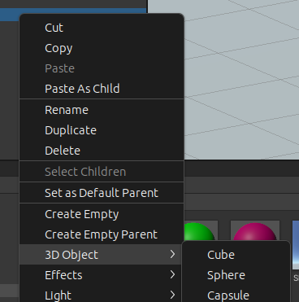
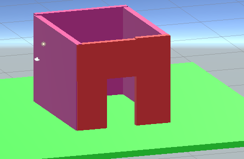
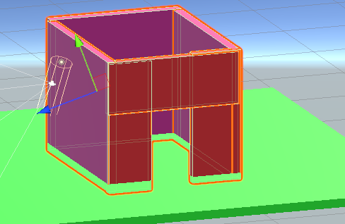
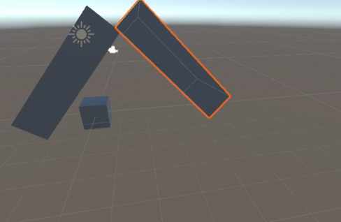
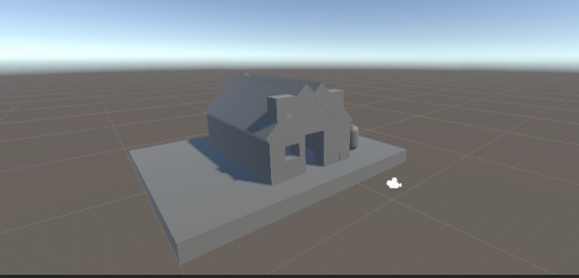
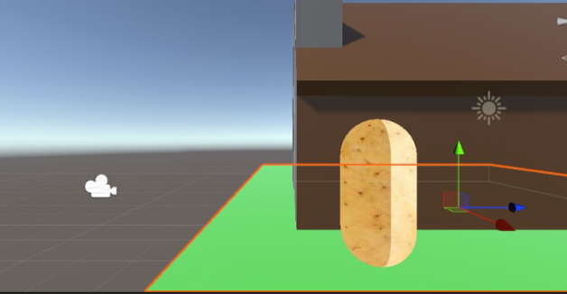
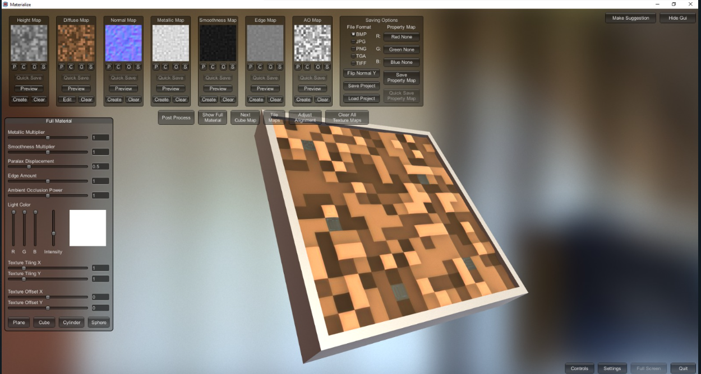
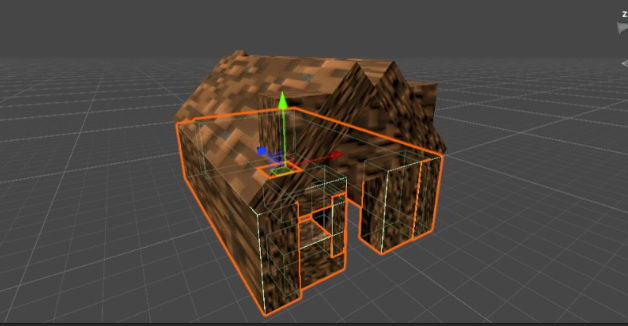
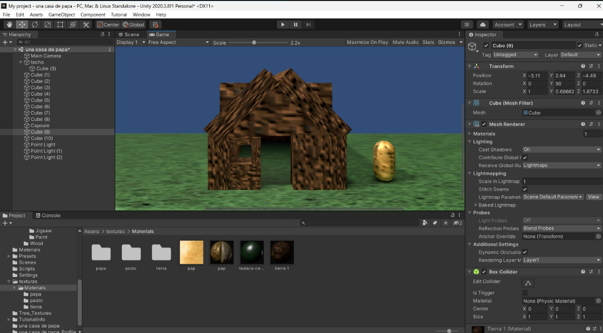

Proyecto00 - Creación de una casa en Unity

Este proyecto tiene como propósito crear una casa en Unity usando solamente cubos.

I. Paredes - Comenzamos creando paredes para nuestra casa. 
Cabe destacar que la pared del frente requiere una puerta, es por eso que la hacemos de manera un poco diferente.

Usamos colores diferentes para que la parte delantera se pueda apreciar y no se mezcle con el resto de la casa.

Para hacer la parte delantera usamos tres cubos. Dos posicionados de manera vertical con cierto espacio entre ellos y uno posicionado
de manera horizontal para hacer dejar un espacio rectangular, el cual sería nuestra puerta.

II. Techo - Siguiendo con el techo, fue creado con dos cubos con una inclinación (ángulo) en la coordenada zeta para asi obtener un techo de dos aguas.

Adicional al techo, decidimos ponerle cobertura para que no se viera espacio entre el techo y las paredes en la parte trasera; logramos esto usando un cubo y
rotándolo 45 grados, obteniendo un rombo. En la parte delantera no se pudo usar esta técnica dado que taparía la abertura de la puerta y se decidió, para no dejar el espacio vacío, colocar un cubo tapándolo.

III. Modelo de casa final

IV. Detalles adicionales - Decidimos colocarle algunos detalles a la casa: 

a) Una papa - Se colocó una papa utilizando el objeto de capsula en unity para representar quien vive en la casa.

b) Texturas - Para que no se viera todo de un mismo color sólido decidimos explorar y tratar de colocarle texturas a todo lo que había sido creado, tomando por referencia el dueño de la casa, que es una papa, se decidió que la casa tuviera una textura de tierra inspirada en el juego "Minecraft".

b.1) Texturas - Las texturas fueron creadas a partir de la imagen original de la textura de tierra de "Minecraft", pasada por la herramienta llamada "Materialize" la cual cumple la función de crear el relieve, las sombras y los diferentes contrastes dependiendo de la luz que le esté dando.

c) Ventana - Usando más cubos logramos crear una abertura en la pared frontal de la casa para hacer la representación de una ventana.

V. Resultado final - Este sería lo obtenido tras pasar por el post-procesado.

VI. Conclusión - Mediante la realización de este proyecto hemos aprendido fundamentos escenciales de la aplicación Unity, al igual que las acciones básicas de movimiento de los objetos y de la cámara; de la misma manera, pudimos llegar un poco más lejos al momento de añadir las texturas y trabajar con la iluminación y cómo estás interactúan de manera superficial con los objetos. Algo interesante que pudimos observar en la elaboración del proyecto fue el cómo con herramientas tan básicas, se es capaz de realizar entornos digitales los cuales hubiesen tomado mucho trabajo años atrás, así mismo la posibilidad de crear entornos muy realistas de manera relativamente sencilla con pocas herramientas y recursos.
